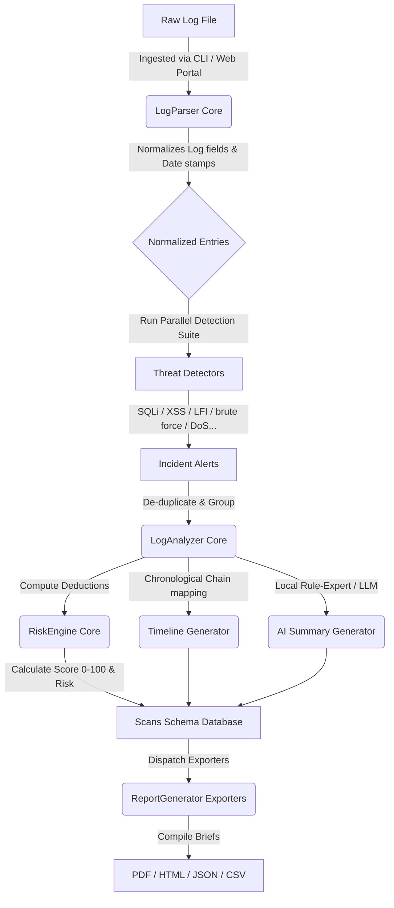

#  LogGuardian AI

> **Intelligent Security Log Analysis & Threat Detection Platform**

LogGuardian AI is a complete, production-grade cybersecurity platform that acts as a virtual junior SOC Analyst. It ingests raw log files, normalizes dates and network indicators, runs ten threat detectors targeting common vulnerabilities, correlates incidents chronologically into attack stages, calculates safety scores, maps detections to MITRE ATT&CK techniques, and auto-generates professional-grade briefs and downloadable reports.

This project is structured as a production-quality portfolio asset suitable for placements and technical interviews in Cybersecurity, Security Engineering, DevSecOps, and Software Architecture roles.

---

##  Main Features

1. **Automatic Format Profile Parsing**: Auto-profiles Apache Access/Error logs, Nginx logs, Linux `auth.log` (SSH successes/failures), Syslog, and Firewall logs, falling back to a generic regex extractor for custom inputs.
2. **Modular Threat Detection Suite**: Includes 10 specialized rule-based detectors targeting web exploits (SQLi, XSS, Path Traversal, Execution), login brute-forcing, volumetric DoS floods, automated scanner agents, and logical credential anomalies.
3. **MITRE ATT&CK Technique Mapping**: Automatically maps every alert to its corresponding Tactic and Technique (e.g., Reconnaissance, Credential Access, Impact).
4. **Chronological Intrusion Timeline**: Reconstructs attack chains by organizing events sequentially and showing stage progression from recon to compromise.
5. **Interactive Web Portal**: Built with Flask and custom dark-theme glassmorphism CSS, featuring interactive Plotly charts, expanding audit trails, and file drop support.
6. **Robust Exporters**: Instantly compiles SIEM-compliant PDF, HTML, JSON, and CSV reports.
7. **Complete SQLite History Database**: Archives scans, metadata summaries, and normalized entries for audit trails.
8. **Command Line Interface (CLI)**: Offers a fully featured local scan tool returning colorized terminal ASCII summary tables.

---

##  Architectural Topology



---

##  Technology Stack & Dependencies

- **Programming Language**: Python 3.11+
- **Backend Framework**: Flask (routing, upload handler, database integrations)
- **Data Wrangling**: Pandas (normalization and aggregations)
- **Database Engine**: SQLite3
- **Document Exporter**: ReportLab (vector PDF generation)
- **Terminal Formatter**: Colorama & Tabulate
- **Frontend Layer**: HTML5, Vanilla CSS3 (custom glassmorphism style sheet), Javascript (AJAX, Plotly.js charts)

---

## Project Directory Structure

```text
LogGuardianAI/
├── app.py                  # Main Flask Web Portal Controller
├── scanner.py              # Command Line Interface (CLI) Scanner Tool
├── config.py               # Global Rules, Regex Patterns & MITRE Mappings
├── database.py             # SQLite Schema Management & Database Queries
├── logger.py               # Rotating File & Colored Console Logger
├── utils.py                # Time Parsers, IP Geolocator Simulation, and Helpers
├── requirements.txt        # Python Packages List
├── README.md               # Documentation & Portfolio Presentation
├── LICENSE                 # MIT Open Source License
├── .gitignore              # Git Exclusions File
│
├── core/
│   ├── parser.py           # Log parser normalization engine
│   ├── analyzer.py         # Threat Orchestrator and Alert De-duplicator
│   ├── risk_engine.py      # Health Score & Risk Rating Calculator
│   ├── ai_summary.py       # Local Heuristics / LLM Writeup Generator
│   ├── timeline.py         # Chronological Attack Narrative Map
│   └── report_generator.py # PDF, HTML, JSON, and CSV exporters
│
├── detectors/
│   ├── brute_force.py      # excessive login failure detector
│   ├── sql_injection.py    # SQL query syntax injection detector
│   ├── xss.py              # JavaScript script-injection detector
│   ├── directory_traversal.py # Relative path traversal finder
│   ├── command_injection.py # Shell command execution validator
│   ├── file_inclusion.py   # LFI / RFI schema validator
│   ├── scanner_detection.py # vulnerability scanners patterns sweep
│   ├── user_agents.py      # scripting libraries & suspicious bot headers
│   ├── dos_detector.py     # volumetric requests window tracking
│   └── auth_anomaly.py     # remote root login and privilege elevations
│
├── templates/
│   ├── index.html          # Web portal homepage upload interface
│   ├── dashboard.html      # Glassmorphic threat dashboards view
│   └── report.html         # Self-contained printable HTML report
│
├── static/
│   ├── style.css           # Styling sheet (dark theme variables, timeline, glow)
│   ├── script.js           # AJAX handlers, file drop events, Plotly charts
│   └── logo.png            # Branded cybersecurity platform logo
│
├── sample_logs/            # Mock attack logs (Apache, Nginx, SSH, Auth, Firewall)
│
├── reports/                # Output folder for compiled scans reports
└── database/
    └── scans.db            # SQLite History records database file
```

---

##  Quick Start & Deployment Guide

### 1. Environment Setup

Clone the repository or move into the workspace directory, then create a virtual environment:

```bash
# Initialize Virtual Environment
python -m venv venv
venv\Scripts\activate      # Windows

# Install Dependencies
pip install -r requirements.txt
```

### 2. Generate Sample Log Files

LogGuardian AI comes with a programmatic log generator to output mock log structures containing realistic attack payloads (XSS, SQLi, SSH brute forcing, etc.):

```bash
python generate_samples.py
```
This writes 5 realistic files inside the `sample_logs/` directory.

### 3. Running the CLI Scanner

Run the scanner directly against any target log:

```bash
# Run auto-detect scan on Apache logs
python scanner.py --file sample_logs/apache.log

# Force specific log type format
python scanner.py --file sample_logs/ssh.log --type linux_auth

# Run scan and export output files elsewhere
python scanner.py -f sample_logs/nginx.log -o customized_reports
```

### 4. Running the Web Portal

To deploy the web-based interactive command dashboard:

```bash
python app.py
```
Open a browser and navigate to `http://127.0.0.1:5000`. You can drag-and-drop any file from the `sample_logs/` folder to view the interactive timeline, graphs, and audit trails.

---


## Threat Detectors & MITRE ATT&CK Mapping Reference

| Detector Module | Target Attack Vector | MITRE Tactic | Technique ID | Technique Name |
| :--- | :--- | :--- | :--- | :--- |
| `brute_force` | Excessive ssh/login failures | Credential Access | T1110 | Brute Force |
| `sql_injection` | URI parameter SQL manipulations | Initial Access | T1190 | Exploit Public-Facing Application |
| `xss` | client-side markup script injections | Initial Access | T1190 | Exploit Public-Facing Application |
| `directory_traversal` | `/etc/passwd` path escapes | Credential Access | T1552 | Unsecured Credentials |
| `command_injection` | shell utility commands (`whoami`) | Execution | T1059 | Command/Scripting Interpreter |
| `file_inclusion` | protocol handlers (`php://filter`) | Execution | T1203 | Exploitation for Client Execution |
| `scanner_detection` | Vulnerability assessment headers | Reconnaissance | T1595 | Active Scanning |
| `user_agents` | Scripting bots (`sqlmap`, `curl`) | Defense Evasion | T1036 | Masquerading |
| `dos_detector` | volumetric requests frequency | Impact | T1498 | Network Denial of Service |
| `auth_anomaly` | Sudo elevation / Compromised logons | Lateral Movement | T1021 | Remote Services |

---

##  Developer Profile

- **Developer Name**: Meera V Nair
- **Position**: Lead Security Architect & DevSecOps Engineer
- **GitHub**: [github.com/meeravnair](https://github.com/meeravnair)
- **License**: MIT Open Source

---

*Disclaimer: LogGuardian AI is designed for log parsing, vulnerability reconnaissance, and training simulations. It should only be run against log files you own or have explicit authorization to audit.*
